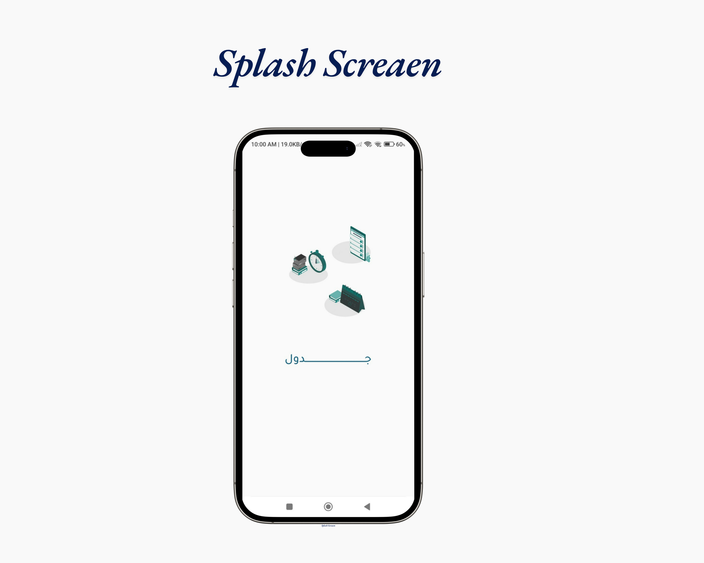
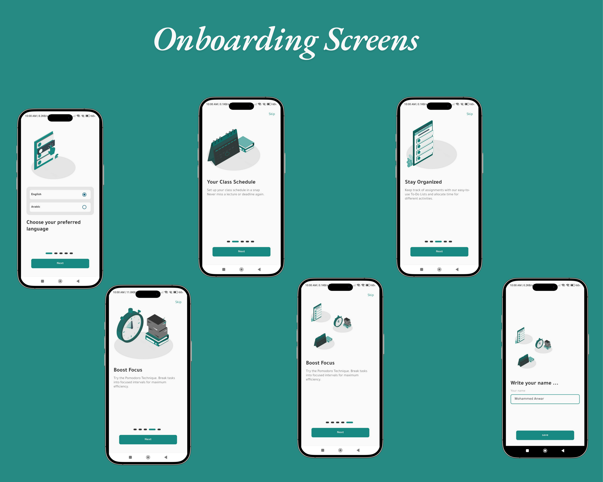
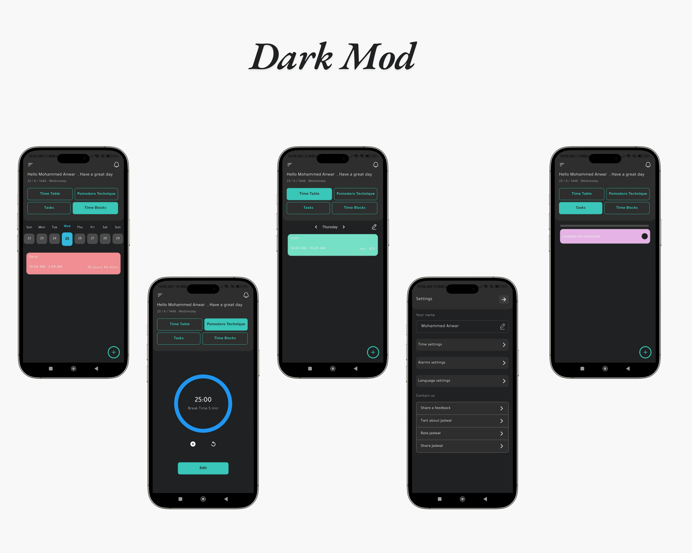
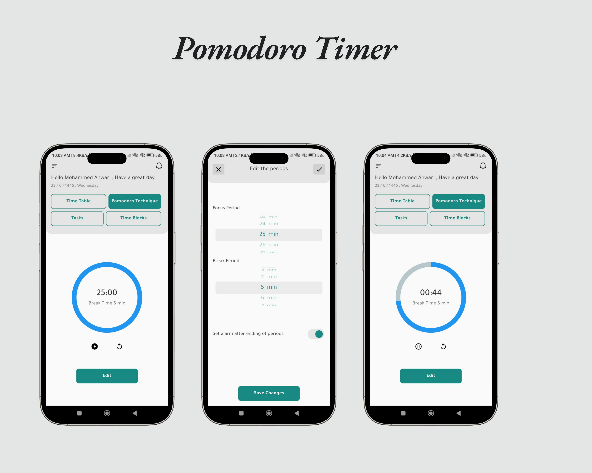
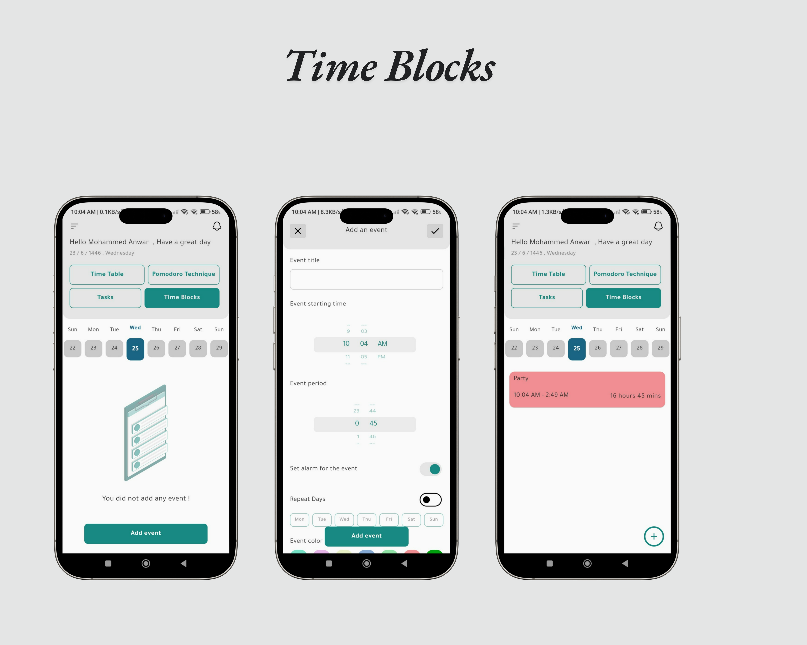
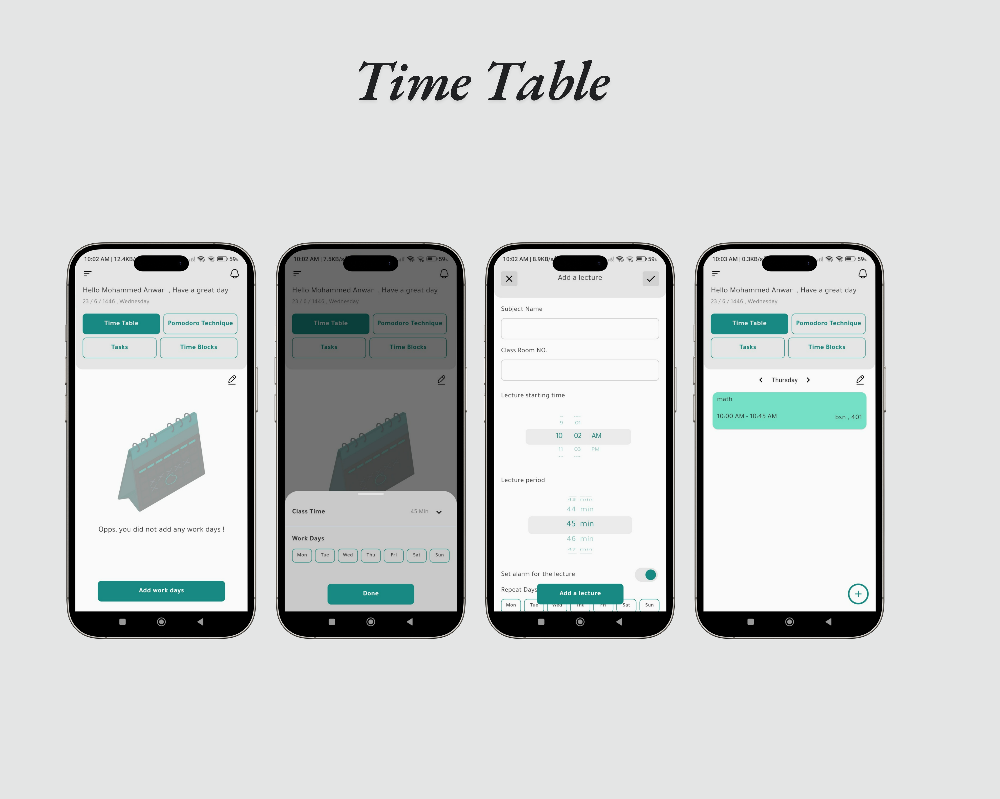
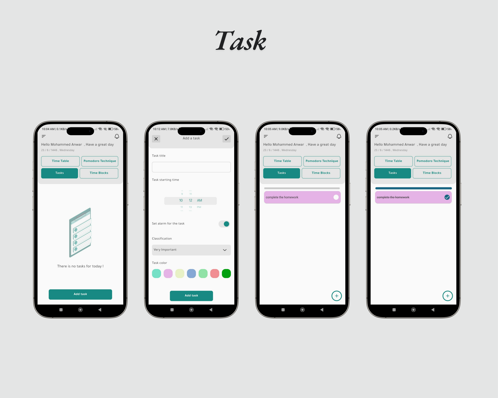
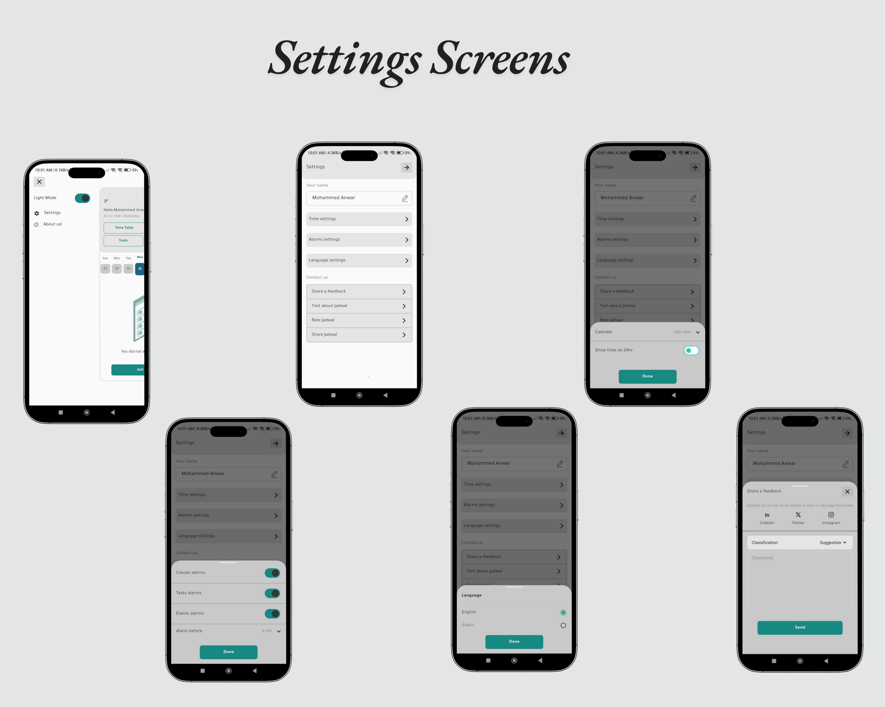

# **Schedule App** 📅⏰

Welcome to **Schedule App**! 🌟📅 This app is designed to revolutionize your time management experience with a comprehensive set of features, all at your fingertips! With its sleek design, powerful functionalities, and an intuitive user interface, **Schedule App** guarantees a fun, fast, and seamless scheduling journey for everyone! ✨🚀

Whether you're looking to manage your tasks, set reminders, or organize your daily activities, we have it all! 🌟 From easy navigation to secure data handling, everything is designed to make your scheduling experience super smooth! 💻📱

---

## **🌟 Features 🌟**
### 1. **Splash Screen** 🌟
 

Experience a smooth and welcoming entry into the Schedule App with our beautiful splash screen!
---
### 1. **Onboarding 🎉📲**

Start your journey with **Schedule App** with an engaging and informative onboarding experience! 🎈📝 Our onboarding screens will guide you through the app, highlighting key features and setting you up for a smooth start.

- **Welcome Screen:** A friendly and warm introduction to **Schedule App** 🏠🎉  
- **Feature Highlights:** Learn about the top features, such as easy navigation, secure data handling, and more! 🏷️💳  
- **Easy Navigation:** Get oriented with the app’s simple, user-friendly interface! 🎮📱  

---

### 2. **Dark and Light Mode 🌙☀️**

Customize your app experience with **Schedule App**'s dark and light modes! 🌙☀️

- **Dark Mode:** Enjoy a sleek, low-light interface that's easy on the eyes, especially in low-light environments. 🌑🖤  
- **Light Mode:** Switch to a bright and vibrant interface for a fresh and energetic feel. 🌞💡  

---

### 3. **Pomodoro Timer 🍅⏲️**

Boost your productivity with **Schedule App**'s Pomodoro Timer! 🍅⏲️

- **Work Sessions:** Focus on tasks for 25-minute intervals, followed by short breaks. 🕒💼  
- **Customizable Intervals:** Adjust work and break durations to suit your workflow. 🔧⏳  
- **Notifications:** Receive reminders to start and end sessions, keeping you on track. 🔔📲  

---

### 4. **Time Blocks 🗓️🔲**

Organize your day with **Schedule App**'s Time Blocks feature! 🗓️🔲

- **Block Scheduling:** Allocate specific time slots for different tasks or activities. 🕒📋  
- **Color Coding:** Assign colors to each block for easy identification. 🎨🖍️  
- **Recurring Blocks:** Set up daily, weekly, or custom recurring blocks to automate your schedule. 🔁📅  

---

### 5. **Time Table 📅🗓️**

Visualize your schedule with **Schedule App**'s Time Table! 📅🗓️

- **Weekly View:** See your entire week at a glance, with all your scheduled blocks and tasks. 📆👀  
- **Drag and Drop:** Easily reschedule tasks by dragging and dropping them within the timetable. 🖱️🔄  
- **Syncing:** Keep your timetable updated across all your devices. 🔄📱💻  

---

### 6. **Task Management 📝✅**

Manage your tasks efficiently with **Schedule App**'s Task Management feature! 📝✅

- **Task Creation:** Add new tasks with titles, descriptions, and due dates. 📝📅  
- **Prioritization:** Mark tasks as high, medium, or low priority. ⚠️🔢  
- **Completion Tracking:** Check off tasks as you complete them and monitor your progress. ✅📈  

---

### 7. **Settings Screens ⚙️🛠️**

Customize your app experience with **Schedule App**'s settings! 🛠️

- **Time Settings:** Adjust time formats, time zones, and working hours to match your preferences. 🕒🌐  
- **Alarm Settings:** Set up alarms for tasks, reminders, and Pomodoro sessions, with options to customize sound, vibration, and repeat intervals. ⏰🔔  
- **Language Settings:** Choose your preferred language for the app interface. 🌐🗣️  
- **Contact Us:** Reach out to us for inquiries, feedback, or support. 📬🤝  
- **Feedback:** Share your thoughts and suggestions to help us improve. 🗣️💬  

---

## **📬 Contact Us 📬**

If you have any questions or need assistance, or if you'd like to discuss suggestions or improvements, feel free to reach out to us! We are here to help! 🤗💬

- **Email:** moanbm123@gmail.com 📧  
- **LinkedIn:** [@Mohammed Anwar](https://www.linkedin.com/in/mohammad-anwar-bin-muslim-50102725b/) 🐦  
- **WhatsApp:** [Contact us on WhatsApp](https://wa.me/+917411440342) 📱  

---

### **🌟 Thank you for visiting! 🌟**

We look forward to your feedback and suggestions to continue improving your scheduling experience with **Schedule App**! ✨💬
